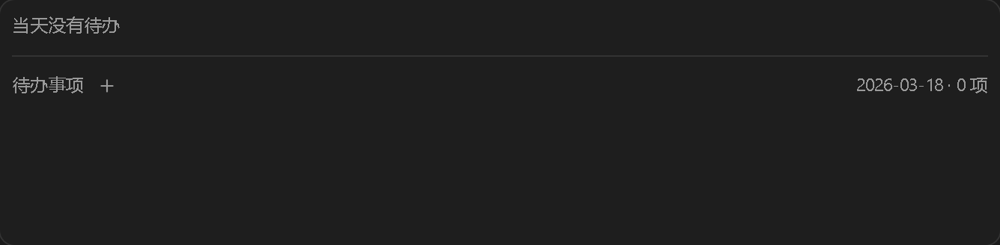
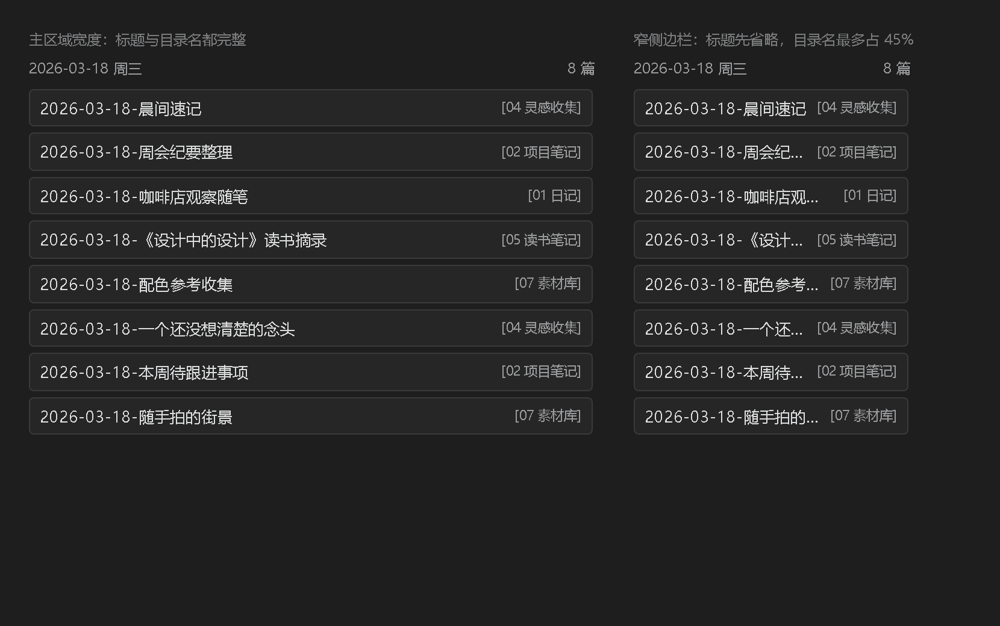
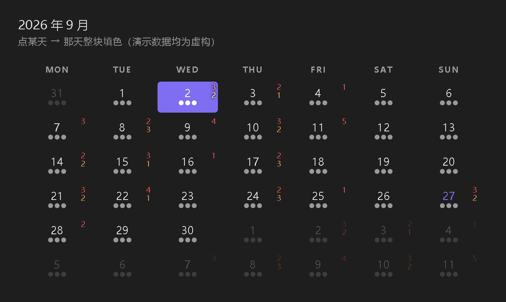

# baixiao-calendar-todo

> 在 [Calendar Hub](https://github.com/HWY1dot0/calendar-hub) 0.2.3 基础上做的**本地定制版**：
> 日历格子上直接显示「当天有多少条笔记、还有几件待办没做」，正在看的那天会被整块填色标出来，
> 日历下面挂一个能勾选、能新增的待办面板，笔记卡片右侧还会标出这条笔记属于哪个目录。

[](LICENSE)


> **截图说明**：下面所有截图都使用**虚构的演示数据**（虚构的月份、笔记名、待办内容），
> 界面由插件真实样式渲染，不含任何真实 vault 内容。


---

## 这个定制版做了什么

原版 Calendar Hub 能在一个日历里汇总「某一天的所有笔记」，但它不告诉你**那天有多少条**、
也管不了**待办**，点某天之后日历上也没有任何视觉反馈。这个版本补了六件事：

### 1. 日历格子右上角的计数徽标

每个日期格子的右上角显示两个很小的数字：

- **红色**（上面）= 当天笔记数
- **橙色**（下面）= 当天**未完成**待办数

两个数字都只在大于 0 时才出现。日期仍然居中、插件原本的圆点位置不变。

**外观全部可调**（设置 → 社区插件 → Calendar Hub → *Calendar cell badges*）：

| 设置项 | 范围 | 默认 | 说明 |
|---|---|---|---|
| Badge font family | 文本 | 空 | 留空 = 继承主题字体 |
| Badge font size | 6–11 | `9` | 格子竖直空间只有约 17px，9 是甜点值 |
| Badge font weight | 400 / 500 / 600 / 700 | `500` | |
| Badge offset X | 0–40 | `3` | 距格子右边缘（往左挪） |
| Badge offset Y | 0–6 | `2` | 距格子顶边缘（往下挪） |
| Badge gap | 0–8 | `1` | 两个数字之间的间距 |
| Note count color | 取色器 | `#e05252` | |
| To-do count color | 取色器 | `#e8964a` | |

改完即时生效，不用重载插件。

### 2. 日历下方的待办面板

- **跟随日历选中的日期**显示当天待办
- **勾选即写回** md 文件（`- [ ]` ↔ `- [x]`）
- 点条目跳到来源笔记
- 标题栏的 **「+」新增待办**（日期 + 内容弹窗，直接写进 md）
- md 被改动后自动刷新
- **横向卡片排列**：卡片尺寸固定，待办再多也只是横向滚动，**不会挤压上面的笔记区**
- 正文超出按行截断加省略号；中文长句、超长英文单词、不带空格的 URL 都能正确断行


待办多的时候横向滚动（滚轮直接可用）：


卡片宽度可调（`--hub-todo-card-w`）：


当天没有待办时的空态：



### 3. 笔记列表瘦身

原版每条笔记卡片显示「标题 + 完整路径」两行。路径双击就能看到，所以这里去掉了，
标题改成一行 + 省略号 —— 卡片高度从约 50px 降到 31.5px，同屏能多看四成条数。
路径没丢：鼠标悬停在卡片上仍会显示完整路径。


### 4. 笔记卡片上的目录名

笔记列表里每条卡片的右侧会贴一个 `[目录名]`，一眼看出这条笔记属于哪个分类，
不用双击打开、也不用悬停看路径。

目录名取的是**路径的第一段**（顶层分类目录），不是直接父目录：

| 笔记路径 | 显示 |
|---|---|
| `06 每日灵感/2026-09/2026-09-24.md` | `[06 每日灵感]` |
| `03 知识库分析报告/01 日报/2026-09/2026-09-08.md` | `[03 知识库分析报告]` |
| `30 内容工坊/01 公众号/03 已发布/2026-07/x.md` | `[30 内容工坊]` |

> 为什么不是「直接父目录」：按年月分层的 vault 里，直接父目录往往是 `2026-09` 这种月份目录，
> 没有信息量。顶层目录才是分类。

**宽度不够时的取舍**：标题优先。目录名最多占卡片宽度的 45%，超了加省略号；
标题永远至少拿到 55%。窄侧边栏下不会把标题挤没。



卡片高度不变（仍是 31.5px）——目录名和标题在**同一行**，不额外占高度。

### 5. 选中日填充

点某天，那天就会整块填上颜色 —— 一眼看出日历现在停在哪一天。



**为什么原版没有这个反馈？** 原版其实有个 `.active` 高亮，但它是从
**「当前打开的文件 → 日期」**反推出来的（`getDateUIDFromFile()`）。这条链路依赖
Obsidian 的**日记（Daily Notes）核心插件配置**：

- 从没配过 `daily-notes.json`，或者
- 笔记文件名带后缀（`06 每日灵感/2026-09/2026-09-02-某篇笔记.md`）

都会导致「文件 → 日期」映射不出来，`selectedId` 恒为 `null`，**高亮永远不会出现**。
这类 vault 里点某天，只有底部笔记列表换了内容，日历本身毫无反应。

定制版改成用**日历自己记住的选中日**驱动（点某天就更新，底部笔记面板显示的也是它），
和文件系统解耦 —— 不管你的日记怎么配、笔记怎么命名，点哪天亮哪一天。

**颜色跟随主题强调色**（`--interactive-accent`），换主题自动适配。想换色不用改代码：

```css
/* 追加到 .obsidian/snippets/ 下的任意 CSS 片段，或在主题里写 */
body {
  --calendar-hub-selected-fill: #458588;   /* 选中日底色 */
  --calendar-hub-selected-text: #fbf1c7;   /* 选中日文字色 */
  --calendar-hub-selected-hover: #458588;  /* 悬停时底色（默认同选中色） */
}
```

> **一个必须说的取舍**：填色之后，格子右上角那两个小徽标会变糊。
> 实测（深色主题、底 `#1d2021`）：笔记数徽标对比度从 3.00 掉到 1.38，
> 待办数从 4.24 掉到 1.96。而且**这个救不回来** —— 纯红对深红也只有 1.89
> （红色的亮度上限被绿/蓝分量锁死），换深青更糟，换更暗的填充自己又看不见。
> 所以给选中日的徽标加了深色描边 + 提亮 1.8 倍：**只提可读性，不改你设的红/橙配色**。
> 不想要这个处理，把 `styles.css` 里 `hub-selected[data-hub-notes]` 那条规则删掉即可。

### 6. 日期解析容错

原版用 moment 的**严格模式**解析文件名里的日期。如果你的文件名里用了
非标准连字符（U+2010 ~ U+2015、U+2212、U+FF0D、U+FE63、U+00AD、U+2043），
这些笔记会被静默跳过、不计入日历。

这个版本在唯一的入口处把这些字符统一归一化成 `-`。
（实测某个 477 篇笔记的 vault 里有 33 个文件受影响。）

---

## 安装

手动安装（这个定制版不在 Obsidian 社区插件列表里）：

```bash
cd "<你的 vault>/.obsidian/plugins/"
git clone https://github.com/csuyincs-creator/baixiao-calendar-todo.git calendar-hub
```

> ⚠️ **文件夹名必须是 `calendar-hub`** —— 要跟 `manifest.json` 里的 `id` 一致。

然后 **设置 → 社区插件 → 已安装插件**，打开 Calendar Hub（需要先关闭「受限模式」）。

**想和官方版共存？** 改 `manifest.json` 的 `id`（比如 `baixiao-calendar-todo`）
并把文件夹改成同名即可。代价是设置不会从官方版继承过来。

---

## 待办数据从哪来

待办面板读的是一个**普通的 Markdown 文件**，格式很简单：

```markdown
## 待办事项说明

### 2026-03-18

- [ ] 整理上周的会议纪要并归档
  来源：[[2026-03-18.md#^I-20260318-2136d0e1f2|来源]]
  完成说明：

- [x] 给设计稿补上暗色模式
  来源：[[2026-03-18.md#^I-20260318-0418e5f6a7|来源]]
  完成说明：
```

- `### YYYY-MM-DD` 开头的三级标题 = 一天
- `- [ ]` / `- [x]` = 未完成 / 已完成
- 缩进的 `来源：[[...]]` 会被解析成来源笔记（点条目可以跳过去）
- `## 待办事项说明` 之前的任何内容（比如索引图）都会被跳过

> ⚠️ **路径是写死的**：默认读 `06 每日灵感/00 清晨方白晓-待办事项.md`。
> 换成你自己的路径只需改 `main.js` 里的一行：
> ```js
> var TODO_NOTE_PATH = "06 每日灵感/00 每日待办.md";
> ```
> 详见 [二开说明](docs/二开说明.md#1-待办文件路径写死了)。

---

## 目录结构

```
.
├── main.js            # 打包产物（已含全部定制），直接装
├── styles.css         # 样式（末尾是定制覆盖块）
├── manifest.json      # 插件清单
├── patches/           # 可重放的补丁脚本 —— 上游升级后用它恢复定制
├── docs/
│   └── 二开说明.md     # 二次开发文档（改哪里、怎么验证、踩过什么坑）
└── screenshots/       # 演示截图（虚构数据）
```

---

## 上游升级了怎么办

这个仓库是**打包产物 + 补丁脚本**，不是源码 fork —— 因为上游只发布编译后的 `main.js`。

Obsidian 检测到上游发新版本时会提示更新，**更新会覆盖 `main.js` / `styles.css`，定制就没了**。
恢复只要两步：

```bash
# 1. 先把新版 main.js / styles.css 拷回插件目录（Obsidian 更新时已经做了）
# 2. 重跑补丁（脚本会自动备份，锚点对不上会明确报错并中止，不会写坏文件）
cd <vault>/.workbuddy/patches     # 或本仓库的 patches/
node calendar-hub-u2011-date.patch.js
node calendar-hub-todo-panel.patch.js
node calendar-hub-layout.patch.js
node calendar-hub-note-dir.patch.js
node calendar-hub-active-fill.patch.js
```

**顺序不能变** —— 后一批补丁的插入锚点来自前一批插入的代码。
补丁是幂等的，重复跑不会重复插入。

如果某个补丁报「锚点未匹配」，说明上游改了那段代码，需要按
[二开说明](docs/二开说明.md) 重新侦察并更新锚点。

---

## 二开（继续改这个插件）

改之前请读 [docs/二开说明.md](docs/二开说明.md)。里面写了：

- 为什么是「补丁」而不是 fork 源码，以及这套做法的取舍
- 怎么读一个 25 万字节的打包产物、去哪找扩展点
- 六个定制点各自改在哪个函数、什么原理
- **怎么做真实验证**（无头浏览器 + 真实 CSS + 重放比对）
- 一路踩过的坑清单（特异性陷阱、`$$` 替换、滚动条吃掉高度、`box-sizing` 对不上……）

---

## 致谢

- [Calendar Hub](https://github.com/HWY1dot0/calendar-hub) — HWY1dot0，本项目的上游
- [obsidian-calendar-plugin](https://github.com/liamcain/obsidian-calendar-plugin) — Liam Cain，Calendar Hub 的前身
- [obsidian-calendar-ui](https://github.com/liamcain/obsidian-calendar-ui)、[obsidian-daily-notes-interface](https://github.com/liamcain/obsidian-daily-notes-interface) — Liam Cain，上游内联打包的两个库

上游项目是 MIT 许可，本仓库的定制部分同样以 MIT 发布，原始版权声明保留在 [LICENSE](LICENSE)。

## 许可

[MIT](LICENSE)
